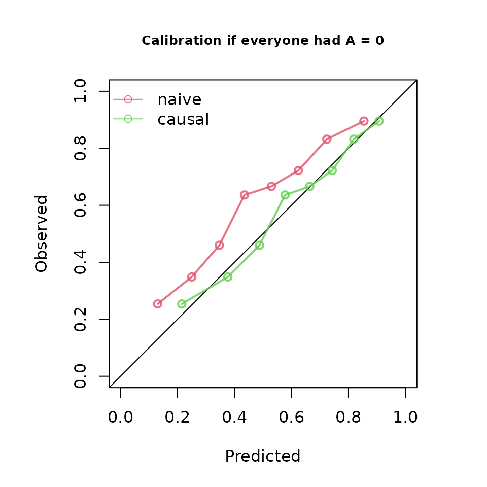
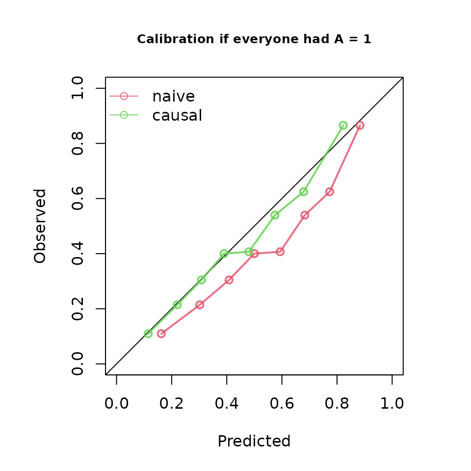

# Calibration under interventions: rticausal and ipeval

This article reproduces the point-intervention calibration example from
the [`ipeval`
vignette](https://cran.r-project.org/web/packages/ipeval/vignettes/ipeval.html)
and compares the resulting calibration curves with `rticausal`.

The statistical target is the same: calibration of predicted risk under
a specified intervention against the inverse-probability-weighted
observed outcome in the corresponding pseudo-population. `ipeval`
estimates the treatment weights from the supplied treatment model;
`rticausal` deliberately requires those weights to be supplied by the
caller.

## Example data and prediction models

``` r

library(ipeval)
library(rticausal)

simulate_data <- function(n, seed) {
  set.seed(seed)
  data <- data.frame(id = seq_len(n))
  data$L <- rnorm(n)
  data$A <- rbinom(n, 1, plogis(2 * data$L))
  data$P <- rnorm(n)
  data$Y <- rbinom(
    n,
    1,
    plogis(0.5 + data$L + 1.25 * data$P - 0.9 * data$A)
  )
  data
}

df_dev <- simulate_data(n = 5000, seed = 1)
df_val <- simulate_data(n = 10000, seed = 2)

model_naive <- glm(Y ~ A + P, family = "binomial", data = df_dev)

trt_model_dev <- glm(A ~ L, family = "binomial", data = df_dev)
propensity_dev <- predict(trt_model_dev, type = "response")
iptw_dev <- 1 / ifelse(df_dev$A == 1, propensity_dev, 1 - propensity_dev)
model_causal <- glm(
  Y ~ A + P,
  family = "binomial",
  data = df_dev,
  weights = iptw_dev
)
#> Warning in eval(family$initialize): non-integer #successes in a binomial glm!

# ipeval estimates validation-set treatment weights from A ~ L internally.
# rticausal consumes caller-supplied weights, so fit the same treatment model
# explicitly for the comparison below.
trt_model_val <- glm(A ~ L, family = "binomial", data = df_val)
propensity_val <- predict(trt_model_val, type = "response")
```

## If nobody were treated: A = 0

For `rticausal`, predictions are generated for every validation subject
after setting treatment to 0. The weights for subjects who were actually
untreated are the inverse probabilities of receiving no treatment.

``` r

pred_0 <- list(
  "naive" = predict(
    model_naive,
    newdata = transform(df_val, A = 0),
    type = "response"
  ),
  "causal" = predict(
    model_causal,
    newdata = transform(df_val, A = 0),
    type = "response"
  )
)
weights_0 <- 1 / (1 - propensity_val)

score_0 <- ip_score(
  object = list(
    "naive" = model_naive,
    "causal" = model_causal
  ),
  data = df_val,
  outcome = Y,
  treatment_formula = A ~ L,
  treatment_of_interest = 0,
  metrics = "calplot",
  null_model = FALSE,
  quiet = TRUE
)
```

### ipeval

``` r

plot(score_0, main = "Calibration if everyone had A = 0")
```



### rticausal

``` r

create_calibration_curve(
  probs = pred_0,
  reals = df_val$Y,
  treats = df_val$A,
  intervention = 0,
  weights = weights_0,
  groups = 8,
  size = 500
)
```

## If everybody were treated: A = 1

``` r

pred_1 <- list(
  "naive" = predict(
    model_naive,
    newdata = transform(df_val, A = 1),
    type = "response"
  ),
  "causal" = predict(
    model_causal,
    newdata = transform(df_val, A = 1),
    type = "response"
  )
)
weights_1 <- 1 / propensity_val

score_1 <- ip_score(
  object = list(
    "naive" = model_naive,
    "causal" = model_causal
  ),
  data = df_val,
  outcome = Y,
  treatment_formula = A ~ L,
  treatment_of_interest = 1,
  metrics = "calplot",
  null_model = FALSE,
  quiet = TRUE
)
```

### ipeval

``` r

plot(score_1, main = "Calibration if everyone had A = 1")
```



### rticausal

``` r

create_calibration_curve(
  probs = pred_1,
  reals = df_val$Y,
  treats = df_val$A,
  intervention = 1,
  weights = weights_1,
  groups = 8,
  size = 500
)
```

The two packages use the same eight rank-based calibration groups for
this comparison. `rticausal` keeps the established rtichoke
presentation, including the prediction histogram, while the
intervention-specific calibration coordinates follow the `ipeval`
calculation.
